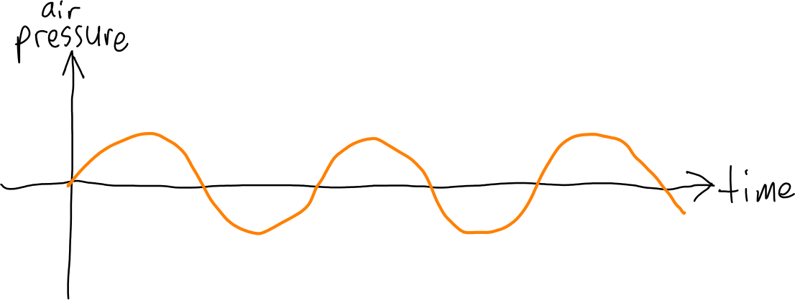
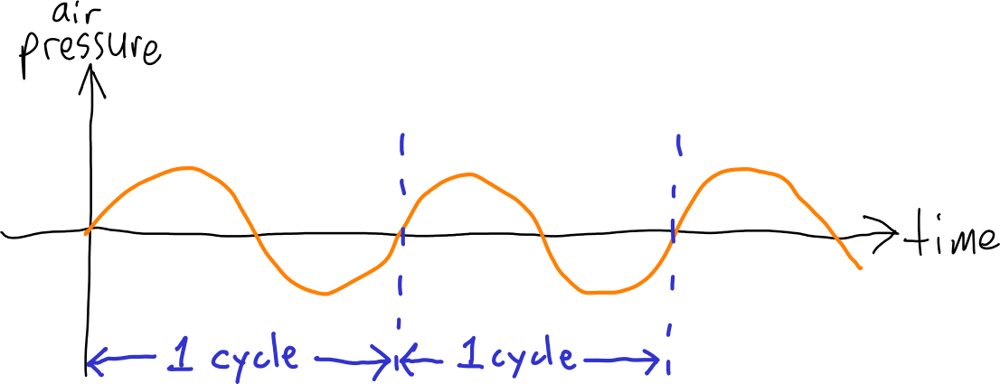
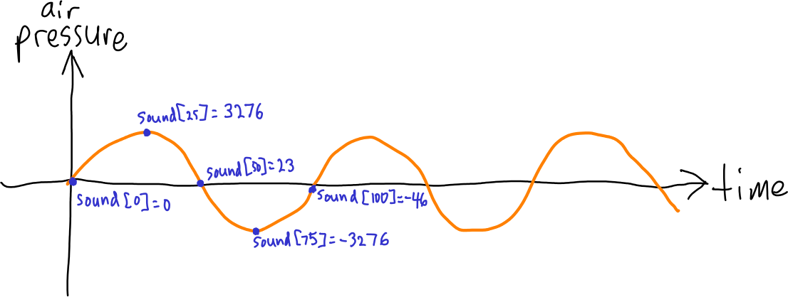

Due: TBD

*This is a preliminary project description, so definitely not official!*

Acknowledgement: This project was inspired by two assignments ([first](http://nifty.stanford.edu/2010/zingaro-song-generator), [second](http://nifty.stanford.edu/2012/zingaro-stereo-sound-processing/)) developed by [Dan Zingaro](http://www.danielzingaro.com/).

## General requirements

In this project you will implement programs to generate and transform digital audio.

This is a pair project, so you will work with one classmate.  You should practice pair programming where you work directly with you partner, in person, to design and implement the program.

You will use git for version control.  You will need to make a new private repository on bitbucket and use the repository settings to allow both team members to access it.

The project is larger and more complex than the previous homework assignments.  You’ll want to start early and make steady, incremental progress towards completing the project requirements.

## Outline

TODO

## Sound

Sound is changes in air pressure over time.  When physical objects vibrate, they cause oscillations in air pressure that propagate outwards in a wave.  A sensor such as a microphone or your ear can detect these changes in pressure over time.

The most basic type of oscillation is a sine wave, where the changes in pressure over time are modeled by the equation

> *p* = *a* × sin(*tf* × 2π)

where *p* is pressure, *t* is time, *f* is frequency, and *a* is amplitude.  Because the sine function yields both positive and negative values, the resulting pressure values (*p*) can be both positive and negative.  The pressure values represent the instantaneous air pressure relative to the overall average air pressure.

Plotted with time on the x-axis and pressure on the y-axis, a sine wave looks like this:

> 

A *cycle* consists of one full oscillation with both positive and positive peaks:

> 

When the frequency increases, the cycles become shorter, so there are more cycles per unit of time.  The standard measurement of frequency, the Hertz (abbreviated Hz), is defined as one cycle per second.  Sound waves have frequencies that range from the low tens of Hz to tens of thousands of Hz.  We perceive sounds with higher frequencies as being higher-pitched.

## Digital sound

There are a variety of ways to represent sound using a computer.  The most straightforward way is using linear [pulse code modulation](https://en.wikipedia.org/wiki/Pulse-code_modulation), where sound is represented as a sequence of *samples*, each sample representing air pressure at a moment in time.  The *sampling frequency* determines how many (evenly spaced) samples there are per unit of time.  CD quality audio, a very common PCM format, uses signed 16 bit samples (ranging from -32,768 to 32,767) and a sampling frequency of 44.1 KHz (44,100 samples per second.)  In C, the `int16_t` data type (defined in the `<stdint.h>` header file) matches the range of data values for CD quality audio.  So, an array of `int16_t` elements can represent CD quality audio: each 44,100 elements represents one second of audio.

To make this idea explicit, let's say that the sound we want to represent is a sine wave with an aplitude of 0.1 and a frequency of 440 Hz.  We'll consider amplitude as being relative to the loudest possible sound, defined as 1.0, so a signal with an amplitude of 0.1 has positive and negative peaks that are 10% as large as the loudest possible signal.  With a sampling frequency of 44.1 KHz, each cycle of our 440 Hz audio signal will be represented by about 100 samples (really 100.227).  The values of the individual samples will vary between (appoximately) -3,276 and 3,276.  Let's say the audio data is in an array of `int16_t` elements called `sound`.  Here is a diagram showing several points on the first cycle of the signal, their values, and which array elements they would be stored in:

> 

As long as the number of bits per sample is reasonably large, and the sampling frequency is reasonably high, PCM can represent audio with a high degree of fidelity to the original sound.

Here is one second of PCM audio of a 440 Hz sine wave with a relative amplitude of 0.1:

> <audio controls><source src="snd/a440.wav" type="audio/wav"></audio>

## Stereo sound, WAVE files

Most sound recordings are *stereo* meaning that there are separate left and right audio channels.  A common way to represent stereo audio is to consider the even-numbered samples as belonging to the left channel, and the odd-numbered samples as belonging to the right channel.

The [WAVE file format](http://soundfile.sapp.org/doc/WaveFormat/) is a common file format for digital audio.  Although a variety of encodings are possible in WAVE files, they are most commonly used for linear PCM audio data.  Wave files represent stereo PCM data using the scheme just described (even samples belong to the left channel, odd samples belong to the right channel.)

## Detailed requirements

This section describes the detailed project requirements.  There are several parts.

### Binary I/O routines

TODO

