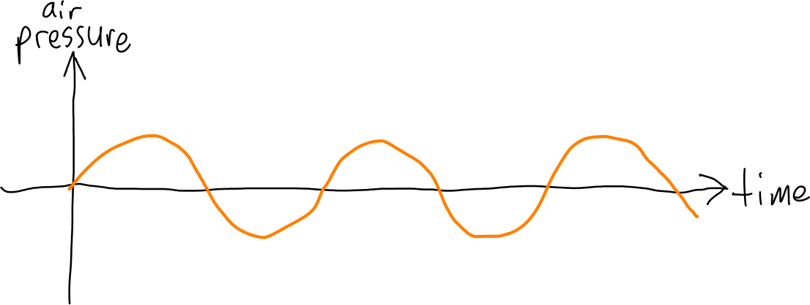
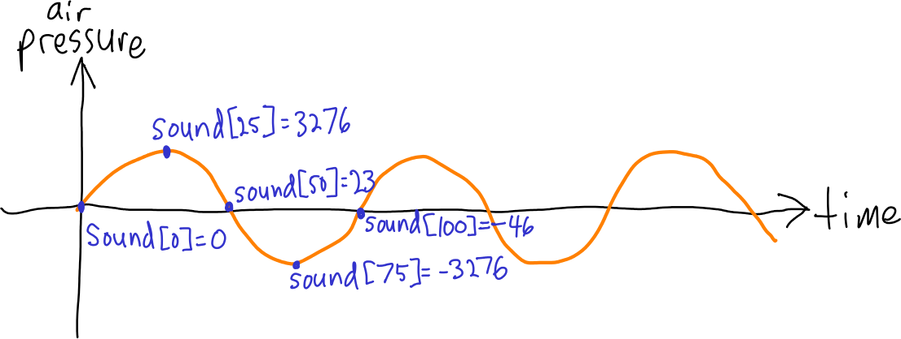

## Sound

This section has some background about sound and how it can be represented digitally.

### What sound is

Sound is changes in air pressure over time.  When physical objects vibrate, they cause oscillations in air pressure that propagate outwards in a wave.  A sensor such as a microphone or your ear can detect these changes in pressure over time.

The most basic type of oscillation is a sine wave, where the changes in pressure over time are modeled by the equation

> *p* = *a* × sin(*tf* × 2π)

where *p* is pressure, *t* is time, *f* is frequency, and *a* is amplitude.  Because the sine function yields both positive and negative values, the resulting pressure values (*p*) can be both positive and negative.  The pressure values represent the instantaneous air pressure relative to the overall average air pressure.

Plotted with time on the x-axis and pressure on the y-axis, a sine wave looks like this:

> 

A *cycle* consists of one full oscillation with both positive and negative peaks:

> 

When the frequency increases, the cycles become shorter, so there are more cycles per unit of time.  The standard measurement of frequency, the Hertz (abbreviated Hz), is defined as one cycle per second.  Sound waves have frequencies that range from the low tens of Hz to tens of thousands of Hz.  We perceive sounds with higher frequencies as being higher-pitched.

Here is what one second of a 440 Hz sine wave sounds like:

> <audio controls><source src="snd/a440.wav" type="audio/wav"></audio>

### Complex audio waveforms

Obviously real sounds are much more complex than just plain sine waves.  In general, any sound can be represented by the *sum* of sine waves of varying frequencies and amplitudes.  Here is one second of a 440 Hz sine wave mixed with a 587.33 Hz sine wave:

> <audio controls><source src="snd/a440_third.wav" type="audio/wav"></audio>

At a physical level, the air pressure changes as the *sum* of the pressure changes induced by all of the sine waves being generated.  Humans can effectively hear multiple tones at the same time, deconstructing the added sine waves into the constituent frequencies.  The example you just heard (440 Hz and 587.33 Hz) is two tones separated by a *major third*, an important frequency interval in western music.

### Digital sound

There are a variety of ways to represent sound using a computer.  The most straightforward way is using linear [pulse code modulation](https://en.wikipedia.org/wiki/Pulse-code_modulation), where sound is represented as a sequence of *samples*, each sample representing air pressure at a moment in time.  The *sampling frequency* determines how many (evenly spaced) samples there are per unit of time.  CD quality audio, a common PCM format, uses signed 16 bit samples (ranging from -32,768 to 32,767) and a sampling frequency of 44.1 KHz (44,100 samples per second.)  In C, the `int16_t` data type (defined in the `<stdint.h>` header file) matches the range of sample data values for CD quality audio.  So, an array of `int16_t` elements can represent CD quality audio: each 44,100 elements represents one second of audio.

To make this idea explicit, let's say that the sound we want to represent is a sine wave with an amplitude of 0.1 and a frequency of 440 Hz.  We'll consider amplitude as being relative to the loudest possible sound, defined as 1.0, so a signal with an amplitude of 0.1 has positive and negative peaks that are 10% as large as the loudest possible signal.  With a sampling frequency of 44.1 KHz, each cycle of our 440 Hz audio signal will be represented by about 100 samples (really 100.227).  The values of the individual samples will vary between (approximately) -3,276 and 3,276.  Let's say the audio data is in an array of `int16_t` elements called `sound`.  Here is a diagram showing several points on the first cycle of the signal, their values, and which array elements they would be stored in:

> 

As long as the number of bits per sample is reasonably large, and the sampling frequency is reasonably high, PCM can represent audio with a high degree of fidelity to the original sound.

### Mixing digital audio signals, clipping

Because sound waves interact additively, you can combine two digital audio signals by simply *adding* their respective sample values.

A potential problem that can arise when adding sample values is that the sum might exceed the maximum positive or negative sample values: for example, 32,767 and -32,768 for 16 bit signed samples.  If this happens, we can't really fully represent the resulting combined signal.  *Clipping* is a phenomenon that results from such overflows, in particular, when we use *saturating* addition such that sums greater than the maximum possible value or less than the minimum possible value (e.g., 32,767/-32,768) are *clamped* at the maximum or minimum.

For example, here is an audio signal where the amplitude exceeds the range that can be represented, with the minimum and maximum sample values shown as light blue dashed lines:

> 

Clipping will change the waveform to the following:

> 

Humans perceive clipping as distortion of the original signals.  Clipping can be avoided by making sure that audio signals being mixed have relatively small amplitudes, so that the sum of their sample values never exceeds the range of representable sample values.

### Stereo sound, WAVE files

Most sound recordings are *stereo* meaning that there are separate left and right audio channels.  A common way to represent stereo audio is to consider the even-numbered samples (0 being the first sample) as belonging to the left channel, and the odd-numbered samples as belonging to the right channel.

The [WAVE file format](http://soundfile.sapp.org/doc/WaveFormat/) is a common file format for digital audio.  Although a variety of encodings are possible in WAVE files, they are most commonly used for linear PCM audio data.  Wave files represent stereo PCM data using the scheme just described (samples 0, 2, 4, etc. belong to the left channel, samples 1, 3, 5, etc. belong to the right channel.)

In this project you will write programs to read and write audio data in the WAVE format.  The good news is that WAVE files are pretty simple: they consist of a *header* followed by raw sample data.  Digital audio programs can represent sound waveforms internally using arrays with sample data.  To read audio data from a WAVE file, a program needs to read the header, and then read the raw sample data into an array.  To write audio data to a WAVE file, a program needs to write the header, and then write the raw sample data from an array.
