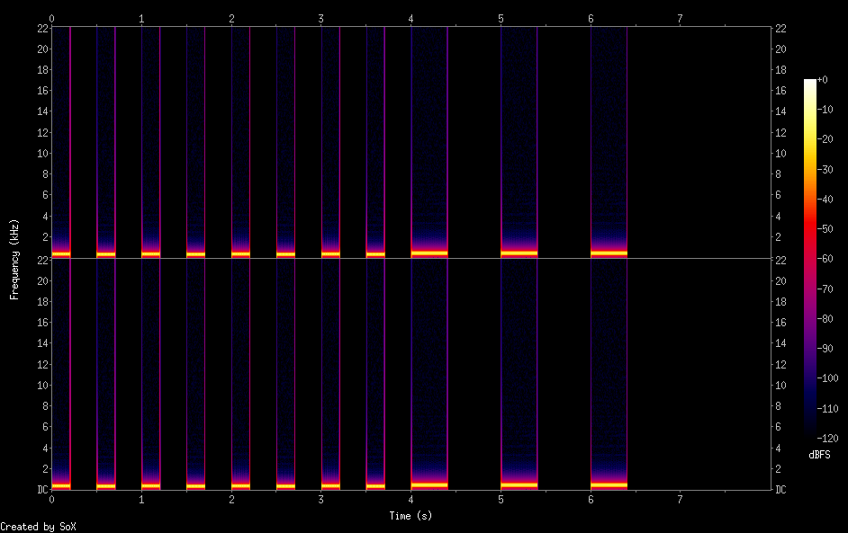
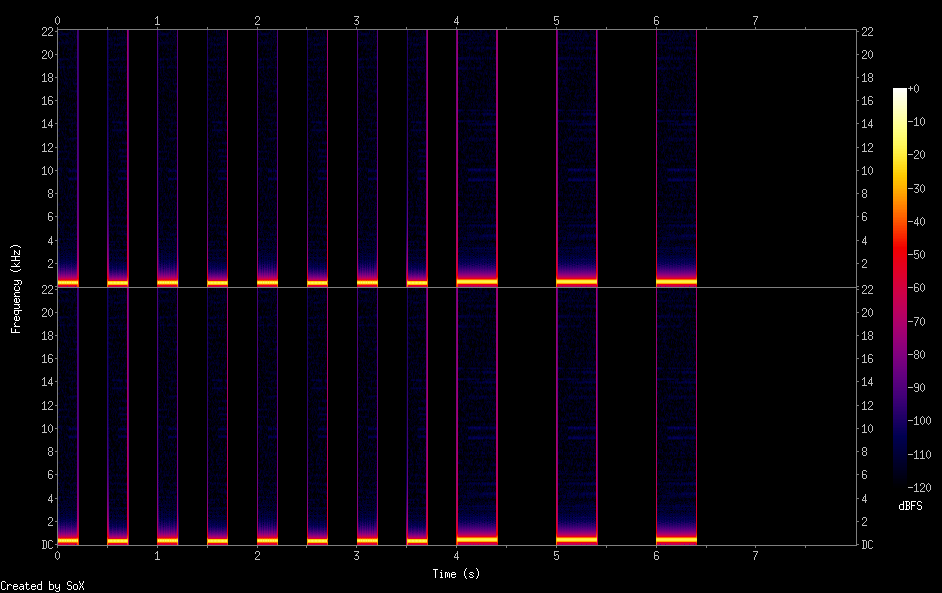
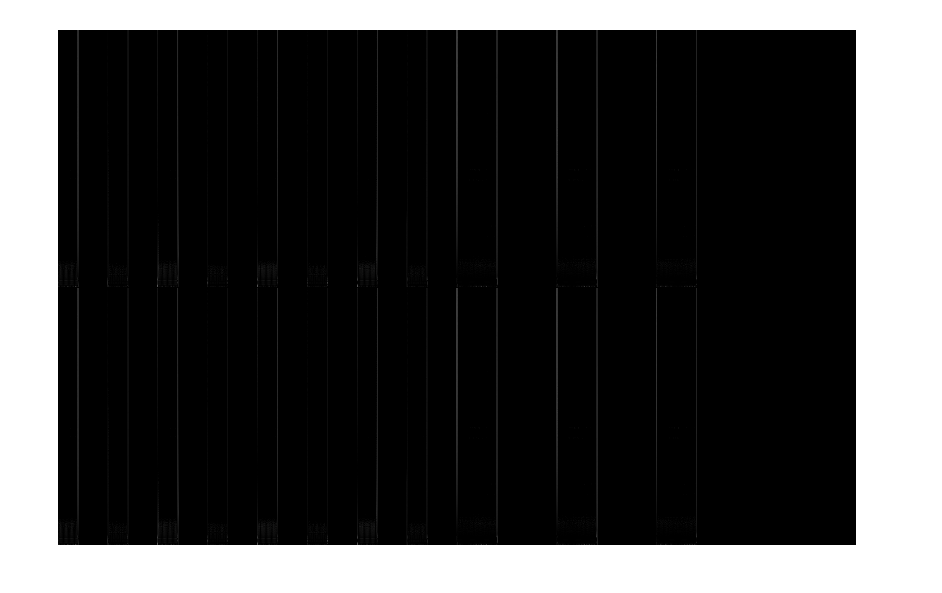
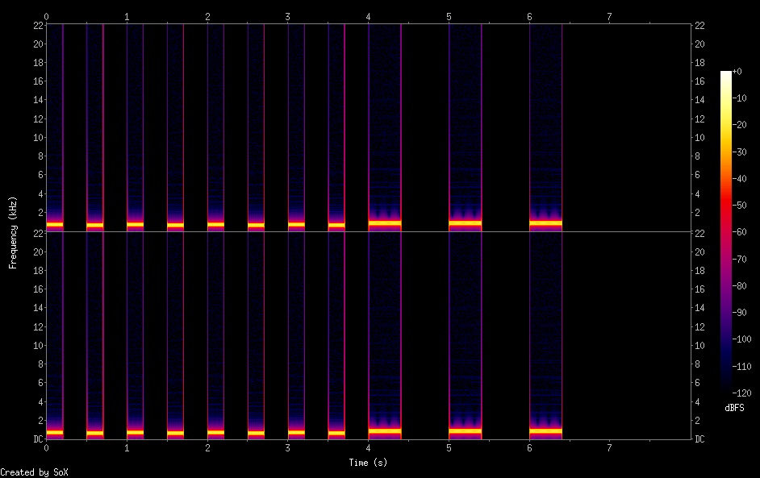
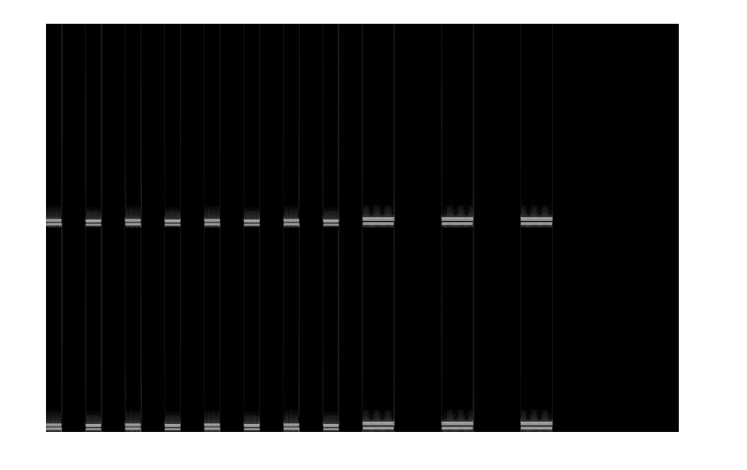

*Updated 10/15*: added information about using [spectrograms](#spectrograms) for testing

This document describes how you can test your programs.

## Getting files to your local computer

If you develop, compile, and test your programs on one of the ugrad machines, you will need to copy the output WAVE file to your local machine so you can play it using a media player program.

Let's say that your local repository (cloned from your team's Bitbucket repository) is in the `midterm_proj` directory of your ugrad account.  Also, let's say that you want to listen to a generated WAVE file called `ticktock.wav` that you generated in `midterm_proj`.  You'll need to use either the `scp` or `pscp` command to copy the file onto your local machine.  For example:

```bash
scp username@ugradx.cs.jhu.edu:midterm_proj/ticktock.wav .
```

(Obviously, replace `username` with your username.)

Once you've copied the file onto your local machine, it's very likely that double-clicking it in a file browser will launch a program (VLC, Windows media player, Quicktime, etc.) capable of playing it.

If you're working in a public lab, you should bring headphones or earbuds so that you can listen to the generated audio without disturbing people working nearby.

## Example files

The following example files are available.

You can download them to your computer by right-clicking the link and choosing **Save link as...**.

To download an example file to your ugrad account, you can right-click on the link, choose **Copy link address**, and then paste the link into a `curl` command in your terminal.  For example:

```bash
curl -O https://jhuintprog.github.io/fall2019/res/ticktock.txt
```

to download `ticktock.txt`.  Note that `-O` in the `curl` command is a hyphen followed by upper case letter "O", not the digit zero.

### Song files

Here are some song files you can use as input to your [render\_song](render_song.html) program.

Link | Description
---- | -----------
[a440.txt](res/a440.txt) | Generate 440 Hz sine wave, output should be [a440.wav](snd/a440.wav)
[a440\_sq.txt](res/a440_sq.txt) | Generate 440 Hz square wave, output should be [a440\_sq.wav](snd/a440_sq.wav)
[a440\_saw.txt](res/a440_saw.txt) | Generate 440 Hz sawtooth wave, output should be [a440\_saw.wav](snd/a440_saw.wav)
[ticktock\_simple.txt](res/ticktock_simple.txt) | Simple version of ticktock song, output should be [ticktock\_simple.wav](snd/ticktock_simple.wav)
[ticktock.txt](res/ticktock.txt) | Better version of ticktock song using chords, output should be [ticktock.wav](snd/ticktock.wav)
[ticktock\_sq.txt](res/ticktock_sq.txt) | Version of `ticktock.txt` using square wave voice, output should be [ticktock\_sq.wav](snd/ticktock_sq.wav)

You should make your own song files, too!

### Sound files

The [render\_echo](render_echo.html) program requires a WAVE file as input.  You can use any of the files linked above, or one of the following files:

Link | Description
---- | -----------
[linux.wav](snd/linux.wav) | Linus Torvalds explaining how to pronounce "Linux"
[linux\_echo.wav](snd/linux_echo.wav) | Output of <tt>./render&#95;echo linux.wav linux&#95;echo.wav 22050 0.4</tt>
[linux\_echo2.wav](snd/linux_echo2.wav) | Output of <tt>./render&#95;echo linux&#95;echo.wav linux&#95;echo2.wav 11025 0.4</tt>

## Spectrograms

A *spectrogram* is a visual representation of frequencies over time.  The [SoX](http://sox.sourceforge.net/) utility (available on the ugrad machines as `sox`) can create spectrograms from WAVE files.

Because of issues such as rounding, floating point arithmetic error, and phase differences, the output files generated by your programs might not exactly match the example outputs byte for byte — small differences are fine, as long as the shape, frequency, amplitude, time, and duration of each generated waveform is correct.  Comparing the spectrogram of a file generated by your program with a spectrogram of an example WAVE file can help give you some confidence that your program's output is correct.

To run `sox` to generate a spectrogram, use the following command:

```
sox myfile.wav -n spectrogram -o myfile.png
```

Replace <tt><i>myfile</i></tt> as appropriate for your file.  You can use `scp` or `pscp` to download the generated spectrogram file to your local computer; use any image viewer or a web browser to view it.

Here is the spectrogram for `ticktock.wav` (click for full size):

> <a href="img/ticktock.png"></a>

So, how can you tell if the spectrogram of your program's output is sufficiently similar to that of the corresponding example output?  The [imgdiff.jar](res/imgdiff.jar) program compares two spectrogram images by comparing the component values of their pixels, generating an output "difference" image and statistics as a result.

As an example: here is a very slightly different version of the ticktock song, rendered with a phase offset:

> <audio controls><source src="snd/ticktock_phase.wav" type="audio/wav"></audio>

It sounds pretty much exactly the same as `ticktock.wav`.  Its spectrogram is very similar to that of `ticktock.wav`:

> <a href="img/ticktock_phase.png"></a>

Let's use `imgdiff.jar` to compare the spectrograms:

```
java -jar imgdiff ticktock.png ticktock_phase.png ticktock_phase_diff.png
```

This command produces the following output:

```
Total difference: 875060
Difference ratio: 0.004159
```

*As a general rule*, if the difference ratio is less than 0.01 (i.e., below 1%), your program's output is likely to be correct.

It also produces an image file called `ticktock_phase_diff.png`, which looks like this:

> <a href="img/ticktock_phase_diff.png"></a>

The gray pixels in the difference image represent the relative difference in color component values of pixels in the input spectrograms.

Now, let's consider a version of the ticktock song where the frequencies are too high by a factor of two:

> <audio controls><source src="snd/ticktock_freq.wav" type="audio/wav"></audio>

This incorrect rendering has the following spectogram:

> <a href="img/ticktock_freq.png"></a>

The `imgdiff.jar` program produces the output

```
Total difference: 2449136
Difference ratio: 0.011639
```

Note the difference ratio value.  The `imgdiff.jar` program also generates the following difference image, in which the horizontal bars represent the mismatched frequencies:

> <a href="img/ticktock_freq_diff.png"></a>
