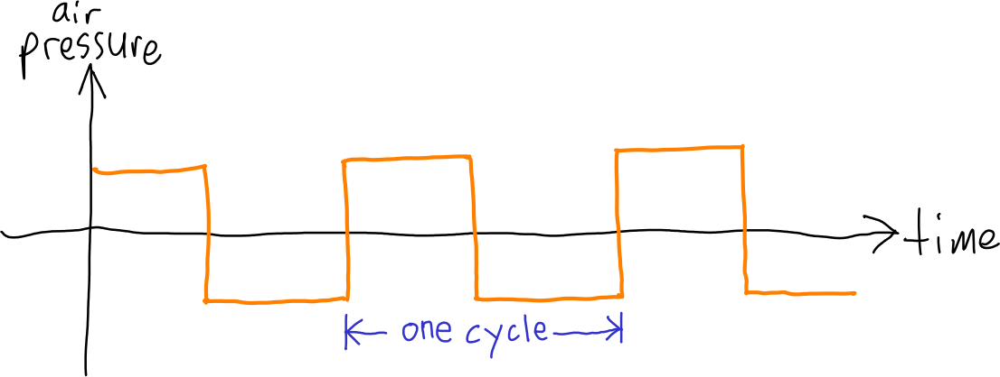
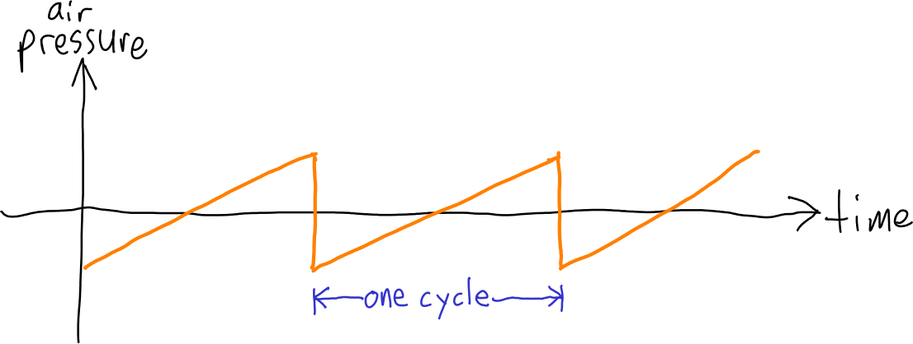

This document describes functions for working with WAVE files and digital audio waveforms.  This module of the program consists of the header file `wave.h` and the source file `wave.c`.

The `write_wave_header` and `read_wave_header` functions require the [binary I/O functions](io.html), so implement those first.

## `wave.h`

The header file `wave.h` has the following suggested contents:

```c
#define PI                 3.14159265358979323846
#define SAMPLES_PER_SECOND 44100u
#define NUM_CHANNELS       2u
#define BITS_PER_SAMPLE    16u

/* voices */
#define SINE       0
#define SQUARE     1
#define SAW        2
#define NUM_VOICES 3 /* one greater than maximum legal voice */

void write_wave_header(FILE *out, unsigned num_samples);
void read_wave_header(FILE *in, unsigned *num_samples);
void render_sine_wave(int16_t buf[], unsigned num_samples, unsigned channel,
  float freq_hz, float amplitude);
void render_sine_wave_stereo(int16_t buf[], unsigned num_samples,
  float freq_hz, float amplitude);
void render_square_wave(int16_t buf[], unsigned num_samples, unsigned channel,
  float freq_hz, float amplitude);
void render_square_wave_stereo(int16_t buf[], unsigned num_samples,
  float freq_hz, float amplitude);
void render_saw_wave(int16_t buf[], unsigned num_samples, unsigned channel,
  float freq_hz, float amplitude);
void render_saw_wave_stereo(int16_t buf[], unsigned num_samples,
  float freq_hz, float amplitude);
void render_voice(int16_t buf[], unsigned num_samples, unsigned channel,
  float freq_hz, float amplitude, unsigned voice);
void render_voice_stereo(int16_t buf[], unsigned num_samples, float freq_hz,
  float amplitude, unsigned voice);
```

The constants `SAMPLES_PER_SECOND` and `BITS_PER_SAMPLE` define the parameters of stereo CD-quality PCM audio.

The constant `PI` closely approximates the value of π.

The constants `SINE`, `SQUARE`, and `SAW` distinguish the three kinds of audio waveforms that the [render\_song](render_song.html) program can generate.

The function declarations are for functions defined in `wave.c`: these are described in more detail below.

## `read_wave_header`, `write_wave_header`

Two functions called `read_wave_header` and `write_wave_header` are provided (including implementations in `wave.c`) which, respectively, read the header information from a WAVE file, and write header information for a WAVE file.  WAVE files are essentially just header information followed by a sequence of sample values.

You can look at the implementation of `read_wave_header` and `write_wave_header` to see how they use your binary I/O functions.  Note that both routines are hard-coded to support only 16 bits per sample, 44.1 KHz, stereo (two channel) WAVE files.  For our purposes, the only "interesting" value in the WAVE header is the number of *stereo* samples, which determines the length of the audio.  Note that a stereo sample consists of *two* 16-bit signed integer values, one for each channel (left and right).


## `render_sine_wave`, `render_square_wave`, `render_saw_wave`

The `render_sine_wave`, `render_square_wave`, and `render_saw_wave` functions generate (respectively) a sine wave, square wave, or sawtooth wave of the specified frequency into the specified stereo sample buffer.  These functions take several parameters:

* The `buf` parameter is the pointer to the first element of an array of `int16_t` elements, each pair of elements representing the left and right samples at one instant in a 44.1 KHz audio stream
* The `num_samples` indicates how many samples to generate; this effectively determines the duration of the rendered audio waveform
* The `channel` parameter indicates which channel to generate (0=left, 1=right)
* The `freq_hz` parameter specifies the frequency of the generated waveform in Hz (cycles per second)
* The `amplitude` parameter indicates the relative amplitude of the generated waveform, where 1.0 is the maximum possible amplitude

A square wave is a waveform where the generated sample values oscillate between maximum and minimum sample values (with respect to the amplitude), i.e.

> <a href="img/sound-square.png"></a>

Square waves are easy to generate using digital electronics, and were used frequently in early home computers and video games.  Here is a 440 Hz square wave:

> <audio controls><source src="snd/a440_sq.wav" type="audio/wav"></audio>

A sawtooth wave rises steadily from the minimum sample value to the maximum sample value (with respect to amplitude) on each cycle, i.e.

> <a href="img/sound-saw.png"></a>

Sawtooth waves have a more "horn-like" sound than a plain sine wave.  Here is a 440 Hz sawtooth wave:

> <audio controls><source src="snd/a440_saw.wav" type="audio/wav"></audio>

The `render_sine_wave_stereo`, `render_square_wave_stereo`, and `render_saw_wave_stereo` functions render a sine, square, or sawtooth waves into both channels of a stereo sample buffer.

The `render_voice` function renders either a sine, square, or sawtooth wave into one channel (0=left, 1=right) of a stereo sample buffer, as indicated by the `voice` parameter.  The value of `voice` should be either `SINE`, `SQUARE`, or `SAW`.

The `render_voice` function renders a sine, square, or sawtooth wave into both channels of a stereo sample buffer, as indicated by the `voice` parameter.

**Important**: Note that you do not need to implement any of the `render_` functions exactly as described above.  You will need to implement functions to generate tones, but you are free to implement them in whatever way you think is appropriate.

**Recommendation**: Don't implement all of the audio generation functions at once.  Implement them as needed to support the three programs you will be implementing, `render_tone`, `render_song`, and `render_echo`.
